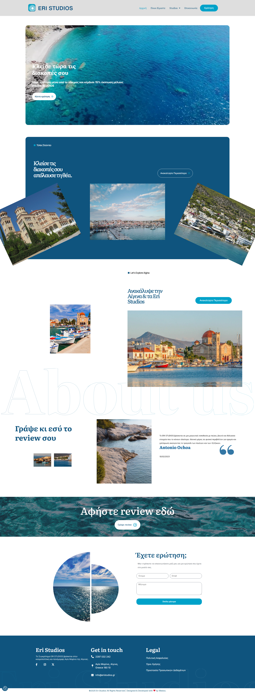
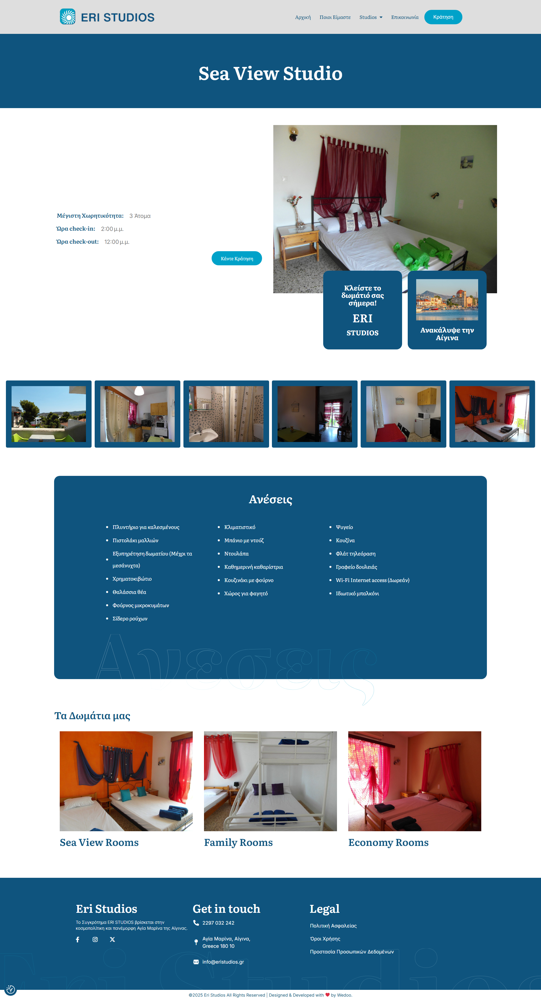
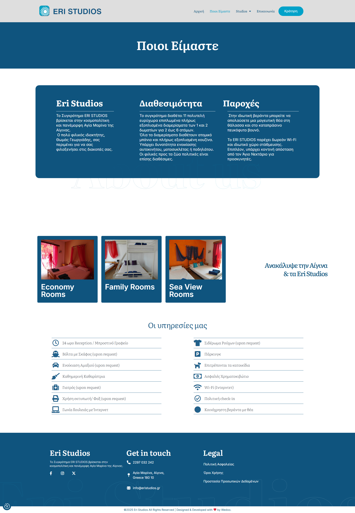

## Live Website
[View Live Site](https://eristudios.gr/)

## Overview 
This is a website I developed while working for Wedoo Digital Agency.
I was responsible for setting up the site from scratch going along with a figma template and equip it with various search engine optimization tweaks along with other techniques after an onsite meeting with the customer.

## My Role
- Front-end development
- Responsive layout
- Performance optimization
- Search Engine Optimization

## Tech Stack
- HTML
- CSS
- Javascript
- Wordpress along with Elementor
- Figma

## Screenshots 

---

---

## Note
The source code belongs to the company and is not included here.
This also is not the actual finished project that I used to  work on, maybe customer wanted changes or something else because there are parts of the site missing the current date im making this readme (17/03/2026)
